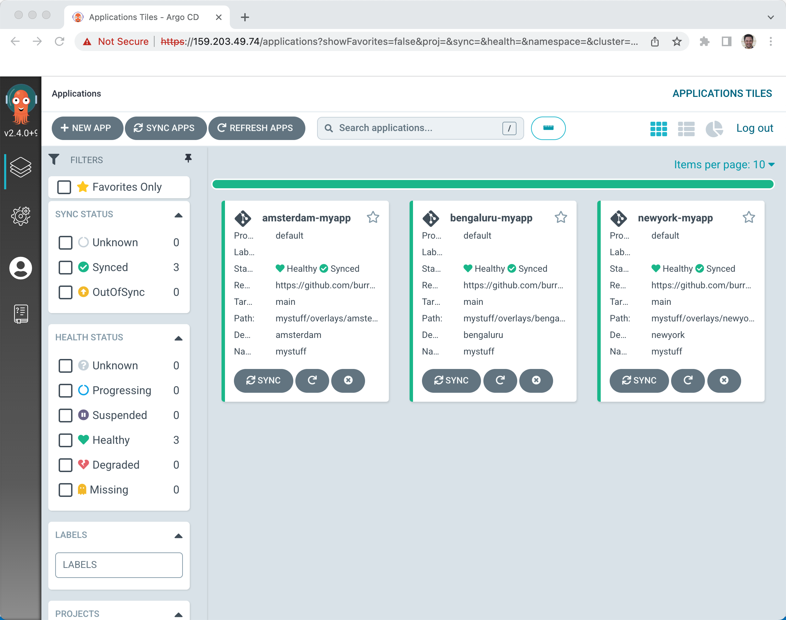

== ArgoCD ApplicationSet

This example uses ArgoCD ApplicationSet in a hub & spoke architecture. A central cluster that "pushes" changes out to spoke clusters.   This is a bit more advanced than the typical ArgoCD tutorial, I recommend working through some of the more basic examples before tackling this more advanced scenario

The 3 clusters are Digital Ocean Kubernetes Service (DOKS) but any Kubernetes cluster should work well.  Amsterdam is my central hub while Toronto and Bangalore serve as spoke clusters.  ArgoCD ApplicationSet allows you to sync your app to all 3 clusters.

=== 3 DOKS clusters

Using the doctl CLI
https://docs.digitalocean.com/reference/doctl/how-to/install/

https://docs.digitalocean.com/products/kubernetes/how-to/connect-to-cluster/

[.console-input]
[source,bash,subs="+macros,+attributes"]
----
brew install doctl
----

[.console-input]
[source,bash,subs="+macros,+attributes"]

----
doctl auth init
----

This will require a token

https://cloud.digitalocean.com/account/api/tokens

[.console-input]
[source,bash,subs="+macros,+attributes"]

----
doctl kubernetes cluster list
----

Download argocd binary
https://github.com/argoproj/argo-cd/releases

Create a place for the 3 KUBECONFIGs.  I like keeping my clusters separated via unique KUBECONFIGs

[.console-input]
[source,bash,subs="+macros,+attributes"]
----
mkdir .kube

export KUBECONFIG=~/devnation/doks/.kube/config-ams3
export KUBECONFIG=~/devnation/doks/.kube/config-blr1
export KUBECONFIG=~/devnation/doks/.kube/config-tor1
----

Other important env vars to configure, making sure kubectl and argocd are in the PATH

[.console-input]
[source,bash,subs="+macros,+attributes"]
----
export KUBE_EDITOR="code -w"
export PATH=~/devnation/bin:$PATH
----

Create the clusters, I do this in 3 different terminal sessions, to keep the environments nicely separated
[.console-input]
[source,bash,subs="+macros,+attributes"]
----
doctl kubernetes cluster create ams3-kubernetes --region ams3 --node-pool="name=worker-pool;count=3"
doctl kubernetes cluster create blr1-kubernetes --region blr1 --node-pool="name=worker-pool;count=2"
doctl kubernetes cluster create tor1-kubernetes --region tor1 --node-pool="name=worker-pool;count=2"
----

The result of an individual cluster creation
[.console-output]
[source,bash,subs="+macros,+attributes"]
----
Notice: Cluster is provisioning, waiting for cluster to be running
...............................................................................
Notice: Cluster created, fetching credentials
Notice: Adding cluster credentials to kubeconfig file found in "/Users/burr/devnation/doks/.kube/config-ams3"
Notice: Setting current-context to do-ams3-ams3-kubernetes
----

See that you have 3 clusters up
[.console-input]
[source,bash,subs="+macros,+attributes"]
----
doctl kubernetes cluster list
----

[.console-output]
[source,bash,subs="+macros,+attributes"]
----
ID                                      Name               Region    Version        Auto Upgrade    Status     Node Pools
386abcb0-61f4-4a75-9b69-2a6587ad30b3    tor1-kubernetes    tor1      1.22.7-do.0    false           running    worker-pool
19075b0c-f790-4c67-97cc-315765860d43    blr1-kubernetes    blr1      1.22.7-do.0    false           running    worker-pool
bc514ba0-1aa8-4dfd-8c83-dc568163865f    ams3-kubernetes    ams3      1.22.7-do.0    false           running    worker-pool
----

Overlay the per cluster $KUBECONFIG files
[.console-input]
[source,bash,subs="+macros,+attributes"]

----
doctl k8s cluster kubeconfig show ams3-kubernetes >> $KUBECONFIG
doctl k8s cluster kubeconfig show blr1-kubernetes >> $KUBECONFIG
doctl k8s cluster kubeconfig show tor1-kubernetes >> $KUBECONFIG
----

Note: doctl does offer an append to KUBECONFIG if you wish
----
doctl kubernetes cluster kubeconfig save tor1-kubernetes
----

Check all 3 clusters
[.console-input]
[source,bash,subs="+macros,+attributes"]
----
kubectl cluster-info
----

[.console-output]
[source,bash,subs="+macros,+attributes"]
----
Kubernetes control plane is running at https://bc514ba0-1aa8-4dfd-8c83-dc568163865f.k8s.ondigitalocean.com
CoreDNS is running at https://bc514ba0-1aa8-4dfd-8c83-dc568163865f.k8s.ondigitalocean.com/api/v1/namespaces/kube-system/services/kube-dns:dns/proxy
----

[.console-output]
[source,bash,subs="+macros,+attributes"]
----
Kubernetes control plane is running at https://19075b0c-f790-4c67-97cc-315765860d43.k8s.ondigitalocean.com
CoreDNS is running at https://19075b0c-f790-4c67-97cc-315765860d43.k8s.ondigitalocean.com/api/v1/namespaces/kube-system/services/kube-dns:dns/proxy
----

[.console-output]
[source,bash,subs="+macros,+attributes"]
----
Kubernetes control plane is running at https://bc514ba0-1aa8-4dfd-8c83-dc568163865f.k8s.ondigitalocean.com
CoreDNS is running at https://bc514ba0-1aa8-4dfd-8c83-dc568163865f.k8s.ondigitalocean.com/api/v1/namespaces/kube-system/services/kube-dns:dns/proxy
----

==== A test deployment
Optional: Deploy a test App on the clusters to see if things are behaving normally

[.console-input]
[source,bash,subs="+macros,+attributes"]
----
kubectl apply -f mystuff/base/namespace.yaml
kubectl config set-context --current --namespace=mystuff
kubectl apply -f mystuff/base/deployment.yaml
kubectl apply -f mystuff/base/service.yaml

# wait for external IP
watch kubectl get service

IP=$(kubectl get service myapp -o jsonpath="{.status.loadBalancer.ingress[0].ip}"):8080
echo $IP
curl $IP

while true
do curl $IP
sleep .3
done
----

[.console-output]
[source,bash,subs="+macros,+attributes"]
----
Aloha from Quarkus! 1 on myapp-76c5cfff4b-gv28s
Aloha from Quarkus! 2 on myapp-76c5cfff4b-gv28s
Aloha from Quarkus! 3 on myapp-76c5cfff4b-gv28s
Aloha from Quarkus! 4 on myapp-76c5cfff4b-gv28s
Aloha from Quarkus! 5 on myapp-76c5cfff4b-gv28s
Aloha from Quarkus! 6 on myapp-76c5cfff4b-gv28s
----

Delete mystuff when done testing as apps will be deployed via ArgoCD next

[.console-input]
[source,bash,subs="+macros,+attributes"]
----
kubectl config set-context --current --namespace=default
kubectl delete namespace mystuff
----

=== Deploy ArgoCD Hub

Deploy ArgoCD into a single cluster. I am using the AMS cluster.

[.console-input]
[source,bash,subs="+macros,+attributes"]
----
kubectl create namespace argocd
kubectl apply -n argocd -f https://raw.githubusercontent.com/argoproj/argo-cd/stable/manifests/install.yaml

kubectl patch svc argocd-server -n argocd -p '{"spec": {"type": "LoadBalancer"}}'
----

Wait for the external IP to be populated

[.console-input]
[source,bash,subs="+macros,+attributes"]
----
watch kubectl get services argocd-server -n argocd
----

[.console-output]
[source,bash,subs="+macros,+attributes"]

----
NAME            TYPE           CLUSTER-IP       EXTERNAL-IP    PORT(S)                      AGE
argocd-server   LoadBalancer   10.245.146.119   167.99.19.77   80:31504/TCP,443:30637/TCP   3m12
----

Get the default password and IP address
[.console-input]
[source,bash,subs="+macros,+attributes"]
----
ARGOCD_PASS=$(kubectl -n argocd get secret argocd-initial-admin-secret -o jsonpath="{.data.password}" | base64 -d)

ARGOCD_IP=$(kubectl -n argocd get service argocd-server -o jsonpath="{.status.loadBalancer.ingress[0].ip}"):80

echo $ARGOCD_IP

echo $ARGOCD_PASS
----

Open the browser to the correct address

[.console-input]
[source,bash,subs="+macros,+attributes"]
----
open http://$ARGOCD_IP
----

Login with "admin" and $ARGOCD_PASS

Also login via the argocd CLI

[.console-input]
[source,bash,subs="+macros,+attributes"]
----
argocd login --insecure --grpc-web $ARGOCD_IP  --username admin --password $ARGOCD_PASS
----

Add the Hub cluster to ArgoCD

[.console-input]
[source,bash,subs="+macros,+attributes"]
----
kubectl config get-contexts -o name
argocd cluster add --kubeconfig $KUBECONFIG do-ams3-ams3-kubernetes --name amsterdam
----

Using the correct terminal, the correct $KUBECONFIG, add Spoke 1
[.console-input]
[source,bash,subs="+macros,+attributes"]
----
kubectl config get-contexts -o name
argocd cluster add --kubeconfig $KUBECONFIG do-blr1-blr1-kubernetes --name bangalore
----

Using the correct terminal, the correct $KUBECONFIG, add Spoke 2
[.console-input]
[source,bash,subs="+macros,+attributes"]
----
kubectl config get-contexts -o name
argocd cluster add --kubeconfig $KUBECONFIG do-tor1-tor1-kubernetes --name toronto
----

Check to see how many clusters you have added
[.console-input]
[source,bash,subs="+macros,+attributes"]
----
argocd cluster list
----

[.console-output]
[source,bash,subs="+macros,+attributes"]
----
SERVER                                                               NAME        VERSION  STATUS   MESSAGE                                              PROJECT
https://19075b0c-f790-4c67-97cc-315765860d43.k8s.ondigitalocean.com  bangalore            Unknown  Cluster has no application and not being monitored.
https://386abcb0-61f4-4a75-9b69-2a6587ad30b3.k8s.ondigitalocean.com  toronto              Unknown  Cluster has no application and not being monitored.
https://bc514ba0-1aa8-4dfd-8c83-dc568163865f.k8s.ondigitalocean.com  amsterdam            Unknown  Cluster has no application and not being monitored.
https://kubernetes.default.svc                                       in-cluster           Unknown  Cluster has no application and not being monitored.
----

[Console Clusters]

On the hub cluster, each imported cluster has a secret.  These secrets become important later.
[.console-input]
[source,bash,subs="+macros,+attributes"]
----
kubectl get secrets -n argocd -l argocd.argoproj.io/secret-type=cluster
----

[.console-output]
[source,bash,subs="+macros,+attributes"]
----
NAME                                                                             TYPE     DATA   AGE
cluster-19075b0c-f790-4c67-97cc-315765860d43.k8s.ondigitalocean.com-3225379585   Opaque   3      5m19s
cluster-386abcb0-61f4-4a75-9b69-2a6587ad30b3.k8s.ondigitalocean.com-3865365367   Opaque   3      5m8s
cluster-bc514ba0-1aa8-4dfd-8c83-dc568163865f.k8s.ondigitalocean.com-4271209868   Opaque   3      6m8s
----

=== Deploy an Application (not yet ApplicationSet)
Deploy an Application to the hub cluster.  This is not yet ApplicationSet for multi-cluster
[.console-input]
[source,bash,subs="+macros,+attributes"]
----
argocd app create myapp-demo --repo https://github.com/burrsutter/doks-argocd.git --path mystuff/base --dest-server https://kubernetes.default.svc --dest-namespace mystuff
argocd app sync myapp-demo
----

[Console Applications]

[.console-input]
[source,bash,subs="+macros,+attributes"]
----
watch kubectl get services -n mystuff
----

[.console-output]
[source,bash,subs="+macros,+attributes"]
----
NAME    TYPE           CLUSTER-IP       EXTERNAL-IP      PORT(S)          AGE
myapp   LoadBalancer   10.245.114.187   161.35.246.253   8080:32185/TCP   3m20s
----

curl your app

[.console-input]
[source,bash,subs="+macros,+attributes"]
----
MYIP=$(kubectl -n mystuff get service myapp -o jsonpath="{.status.loadBalancer.ingress[0].ip}"):8080

while true
do curl $MYIP
sleep .3
done
----

[.console-output]
[source,bash,subs="+macros,+attributes"]
----
Aloha from Quarkus! 1 on myapp-76c5cfff4b-2wqg8
Aloha from Quarkus! 2 on myapp-76c5cfff4b-2wqg8
Aloha from Quarkus! 3 on myapp-76c5cfff4b-2wqg8
----

Make a change to base/deployment.yaml and make it sync
----
git commit -am "updated something"
git push
argocd app sync myapp-demo --prune
----

[.console-input]
[source,bash,subs="+macros,+attributes"]
----
while true
do curl $MYIP
sleep .3
done

AlohaX from Quarkus! 1 on myapp-5c8f597d8-j2m6c
AlohaX from Quarkus! 2 on myapp-5c8f597d8-j2m6c
----

Clean up App
[.console-input]
[source,bash,subs="+macros,+attributes"]
----
argocd app delete myapp-demo
----

wait for it to disappear, there should be no Apps 

[.console-input]
[source,bash,subs="+macros,+attributes"]
----
argocd app list
----
[.console-output]
[source,bash,subs="+macros,+attributes"]
----
NAME  CLUSTER  NAMESPACE  PROJECT  STATUS  HEALTH  SYNCPOLICY  CONDITIONS  REPO  PATH  TARGET
----

Create an ApplicationSet for N clusters

[.console-input]
[source,bash,subs="+macros,+attributes"]
----
kubectl apply -f myapplicationset.yaml -n argocd
----

----
kubectl get applicationset -n argocd
NAME    AGE
myapp   5s
----

Still there should be no Apps, Apps are "generated" later
[.console-input]
[source,bash,subs="+macros,+attributes"]
----
argocd app list
NAME             CLUSTER                                                              NAMESPACE  PROJECT  STATUS  HEALTH       SYNCPOLICY  CONDITIONS  REPO                                           PATH                        TARGET
amsterdam-myapp  https://bc514ba0-1aa8-4dfd-8c83-dc568163865f.k8s.ondigitalocean.com  mystuff    default  Synced  Progressing  Auto-Prune  <none>      https://github.com/burrsutter/doks-argocd.git  mystuff/overlays/amsterdam  main
bangalore-myapp  https://19075b0c-f790-4c67-97cc-315765860d43.k8s.ondigitalocean.com  mystuff    default  Synced  Progressing  Auto-Prune  <none>      https://github.com/burrsutter/doks-argocd.git  mystuff/overlays/bangalore  main
toronto-myapp    https://386abcb0-61f4-4a75-9b69-2a6587ad30b3.k8s.ondigitalocean.com  mystuff    default  Synced  Progressing  Auto-Prune  <none>      https://github.com/burrsutter/doks-argocd.git  mystuff/overlays/toronto    main
----

Remember

[.console-input]
[source,bash,subs="+macros,+attributes"]
----
kubectl get secrets -n argocd -l argocd.argoproj.io/secret-type=cluster
----

Add the correct magic label

[.console-input]
[source,bash,subs="+macros,+attributes"]
-----
kubectl label secret env=myapptarget -n argocd -l argocd.argoproj.io/secret-type=cluster
-----

This magic label comes from the file myapplicationset.yaml

[.console-input]
[source,bash,subs="+macros,+attributes"]
----
spec:
  generators:
  - clusters:
      selector:
        matchLabels:
          env: myapptarget
----

[.console-input]
[source,bash,subs="+macros,+attributes"]
----
kubectl get secrets  -l env=myapptarget -n argocd
----

The other bit of magic is that the overlay names match the cluster names

[.console-input]
[source,bash,subs="+macros,+attributes"]
----
├── mystuff
│   ├── base
│   │   ├── deployment.yaml
│   │   ├── kustomization.yaml
│   │   ├── namespace.yaml
│   │   └── service.yaml
│   └── overlays
│       ├── amsterdam
│       │   ├── deployment.yaml
│       │   └── kustomization.yaml
│       ├── bangalore
│       │   ├── deployment.yaml
│       │   └── kustomization.yaml
│       └── toronto
│           ├── deployment.yaml
│           └── kustomization.yaml
----

[.console-input]
[source,bash,subs="+macros,+attributes"]
----
argocd cluster list
SERVER                                                               NAME        VERSION  STATUS      MESSAGE                                              PROJECT
https://bc514ba0-1aa8-4dfd-8c83-dc568163865f.k8s.ondigitalocean.com  amsterdam            Unknown     Cluster has no application and not being monitored.
https://386abcb0-61f4-4a75-9b69-2a6587ad30b3.k8s.ondigitalocean.com  toronto              Unknown     Cluster has no application and not being monitored.
https://19075b0c-f790-4c67-97cc-315765860d43.k8s.ondigitalocean.com  bangalore            Unknown     Cluster has no application and not being monitored.
https://kubernetes.default.svc                                       in-cluster  1.22     Successful
----

[.console-input]
[source,bash,subs="+macros,+attributes"]
----
kubectl describe applicationset myapp
----

----
argocd app list
NAME             CLUSTER                                                              NAMESPACE  PROJECT  STATUS  HEALTH       SYNCPOLICY  CONDITIONS  REPO                                           PATH                        TARGET
amsterdam-myapp  https://bc514ba0-1aa8-4dfd-8c83-dc568163865f.k8s.ondigitalocean.com  mystuff    default  Synced  Progressing  Auto-Prune  <none>      https://github.com/burrsutter/doks-argocd.git  mystuff/overlays/amsterdam  main
bangalore-myapp  https://19075b0c-f790-4c67-97cc-315765860d43.k8s.ondigitalocean.com  mystuff    default  Synced  Progressing  Auto-Prune  <none>      https://github.com/burrsutter/doks-argocd.git  mystuff/overlays/bangalore  main
toronto-myapp    https://386abcb0-61f4-4a75-9b69-2a6587ad30b3.k8s.ondigitalocean.com  mystuff    default  Synced  Progressing  Auto-Prune  <none>      https://github.com/burrsutter/doks-argocd.git  mystuff/overlays/toronto    main
----

[3 Apps]

On each cluster wait for the external IP address
----
MYIP=$(kubectl -n mystuff get service myapp -o jsonpath="{.status.loadBalancer.ingress[0].ip}"):8080

while true
do curl $MYIP
sleep .3
done
----

image::./images/argocd-5.png[][iTerm2 3 clusters] 

=== Rollout an update

To see a rollout, edit overlays/toronto/deployment.yaml, switch between "Hi" and "Bonjour"

You can wait for the 3 minute default polling interval
OR you can configure a webhook
OR you can just Refresh Hard

image::./images/argocd-6.png[][Refresh Hard]

image::./images/argocd-7.png[][Rollout]

=== Clean Up

Remove all clusters, save some money
----
doctl k8s cluster delete ams3-kubernetes
doctl k8s cluster delete blr1-kubernetes
doctl k8s cluster delete tor1-kubernetes
----

Remove all load-balancers, those seem to hang around even when clusters are deleted
----
doctl compute load-balancer list
doctl compute load-balancer delete 1069dd38-35e8-4f6a-a968-408ff86b78c6
----

ToDo - work on a bash shell script to wait for external IP to populate
https://stackoverflow.com/questions/66114851/kubectl-wait-for-service-to-get-external-ip

