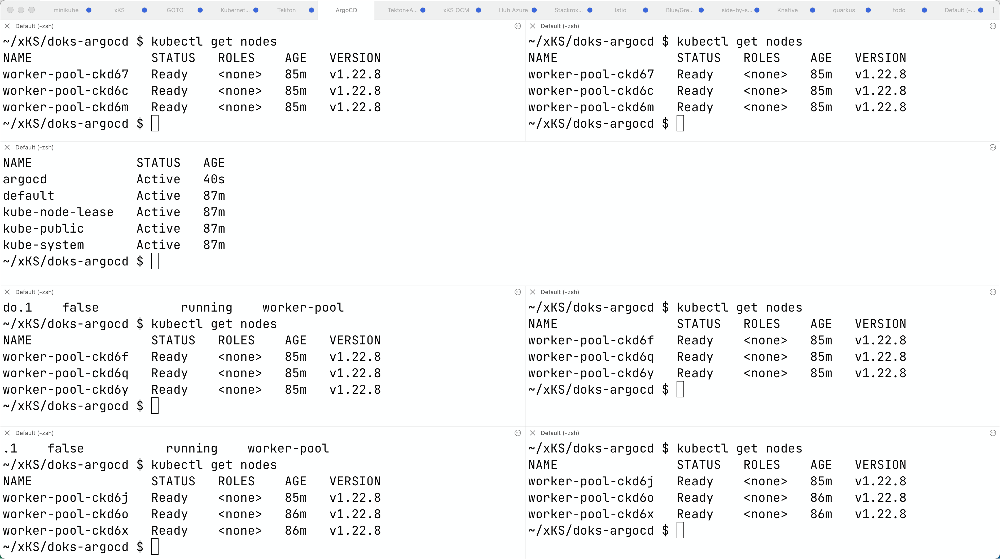
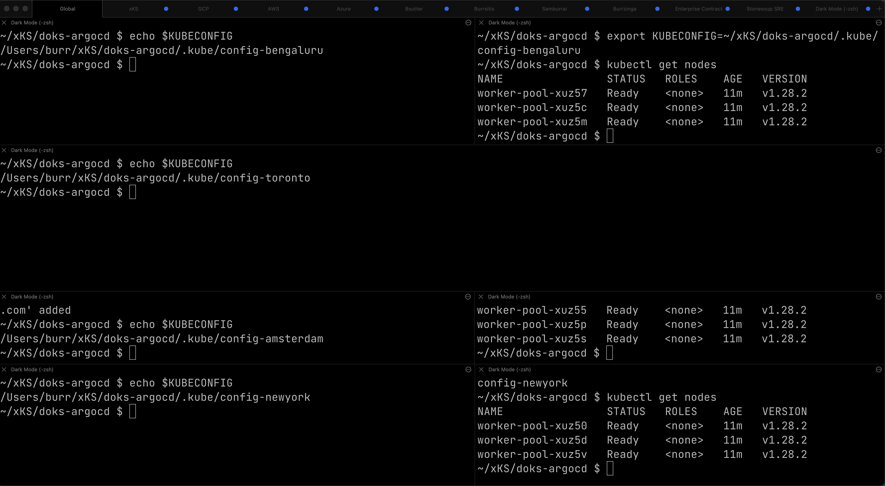

# ArgoCD ApplicationSet

This example uses ArgoCD ApplicationSet in a hub & spoke architecture. A central cluster that "pushes" changes out to spoke clusters.   This is a bit more advanced than the typical ArgoCD tutorial, I recommend working through some of the more basic examples before tackling this more advanced scenario

The 4 clusters are Digital Ocean Kubernetes Service (DOKS) but any Kubernetes cluster should work well.  ArgoCD ApplicationSet allows you to sync your app to all three spoke clusters.

Video of ArgoCD ApplicationSet in action

https://youtu.be/RvE85FknYMc

## DOKS clusters

Using the doctl CLI
https://docs.digitalocean.com/reference/doctl/how-to/install/

https://docs.digitalocean.com/products/kubernetes/how-to/connect-to-cluster/

```
brew install doctl
```


```
doctl auth init
```

This will require a token

https://cloud.digitalocean.com/account/api/tokens


Do you have any clusters up?

```
doctl kubernetes cluster list
```

Do you have any load-balancers up?  These are a result from using Service type Load-Balancer

```
doctl compute load-balancer list
```

Download argocd binary

https://github.com/argoproj/argo-cd/releases

Important env vars to configure, making sure kubectl and argocd are in the PATH

```
export KUBE_EDITOR="code -w"
export PATH=~/devnation/bin:$PATH
```


Create a place for the KUBECONFIGs.  I like keeping my clusters separated via unique KUBECONFIGs

```
mkdir .kube
```

```
export KUBECONFIG=~/xKS/doks-argocd/.kube/config-amsterdam
```

```
export KUBECONFIG=~/xKS/doks-argocd/.kube/config-bengaluru
```

```
export KUBECONFIG=~/xKS/doks-argocd/.kube/config-newyork
```

Optional - HUB

```
export KUBECONFIG=~/xKS/doks-argocd/.kube/config-toronto
```


Create the clusters, I do this in 4 different terminal sessions, to keep the environments nicely separated

```
doctl kubernetes cluster create amsterdam --region ams3 --node-pool="name=worker-pool;count=3"
```

```
doctl kubernetes cluster create bengaluru --region blr1 --node-pool="name=worker-pool;count=3"
```

```
doctl kubernetes cluster create newyork --region nyc1 --node-pool="name=worker-pool;count=3"
```

Optional - HUB

```
doctl kubernetes cluster create toronto --region tor1 --node-pool="name=worker-pool;count=3"
```


The result of an individual cluster creation

```
Notice: Cluster is provisioning, waiting for cluster to be running
...............................................................................
Notice: Cluster created, fetching credentials
Notice: Adding cluster credentials to kubeconfig file found in "/Users/burr/xKS/doks-argocd/.kube/config-amsterdam"
Notice: Setting current-context to do-ams3-amsterdam
```

See that you have at least 3 clusters up 
  
The Hub could be [OpenShift + Gitops Operator](https://docs.openshift.com/container-platform/4.10/cicd/gitops/understanding-openshift-gitops.html)

```
doctl kubernetes cluster list
```

```
ID                                      Name         Region    Version        Auto Upgrade    Status     Node Pools
d327a00b-43e2-4da3-ba55-64c335480198    toronto      tor1      1.22.8-do.1    false           running    worker-pool
a8e1d83e-bcfd-4ee7-a166-9d94b7abf75a    newyork      nyc1      1.22.8-do.1    false           running    worker-pool
953550fa-ef95-4bb6-b6c4-799b50518ec4    bengaluru    blr1      1.22.8-do.1    false           running    worker-pool
545b45c4-a0e1-4e14-ab74-0ba74bfb7ef5    amsterdam    ams3      1.22.8-do.1    false           running    worker-pool
```

If needed, overlay the per cluster $KUBECONFIG files

```
doctl k8s cluster kubeconfig show amsterdam >> $KUBECONFIG
```

```
doctl k8s cluster kubeconfig show bengaluru >> $KUBECONFIG
```

```
doctl k8s cluster kubeconfig show newyork >> $KUBECONFIG
```

```
doctl k8s cluster kubeconfig show toronto >> $KUBECONFIG
```

Note: doctl does offer an append to KUBECONFIG if you wish
```
doctl kubernetes cluster kubeconfig save toronto
```

Check all clusters

```
kubectl get nodes
```

The Spoke clusters have 2 windows/terminals each



#### Optional: Test vanilla deployment
Optional: Deploy a test App on the clusters to see if things are behaving normally

```
kubectl apply -f mystuff/base/namespace.yaml
kubectl config set-context --current --namespace=mystuff
kubectl apply -f mystuff/base/deployment.yaml
kubectl apply -f mystuff/base/service.yaml

# wait for external IP
watch kubectl get service

IP=$(kubectl get service myapp -o jsonpath="{.status.loadBalancer.ingress[0].ip}"):8080
echo $IP
curl $IP

while true
do curl $IP
sleep .3
done
```

```
Aloha from Quarkus! 1 on myapp-76c5cfff4b-gv28s
Aloha from Quarkus! 2 on myapp-76c5cfff4b-gv28s
Aloha from Quarkus! 3 on myapp-76c5cfff4b-gv28s
Aloha from Quarkus! 4 on myapp-76c5cfff4b-gv28s
Aloha from Quarkus! 5 on myapp-76c5cfff4b-gv28s
Aloha from Quarkus! 6 on myapp-76c5cfff4b-gv28s
```

Delete mystuff when done testing as apps will be deployed via ArgoCD next

```
kubectl config set-context --current --namespace=default
kubectl delete namespace mystuff
```


### Deploy ArgoCD Hub

Deploy ArgoCD into a single cluster. Using the Toronto cluster below

```
kubectl create namespace argocd
kubectl apply -n argocd -f https://raw.githubusercontent.com/argoproj/argo-cd/stable/manifests/install.yaml

kubectl patch svc argocd-server -n argocd -p '{"spec": {"type": "LoadBalancer"}}'
```

Wait for the external IP to be populated

```
watch kubectl get services argocd-server -n argocd
```

```
NAME            TYPE           CLUSTER-IP       EXTERNAL-IP    PORT(S)                      AGE
argocd-server   LoadBalancer   10.245.146.119   167.99.19.77   80:31504/TCP,443:30637/TCP   3m12
```

Get the default password and IP address

```
ARGOCD_PASS=$(kubectl -n argocd get secret argocd-initial-admin-secret -o jsonpath="{.data.password}" | base64 -d)

ARGOCD_IP=$(kubectl -n argocd get service argocd-server -o jsonpath="{.status.loadBalancer.ingress[0].ip}"):80

echo $ARGOCD_IP

echo $ARGOCD_PASS
```

Open the browser to the correct address

```
open http://$ARGOCD_IP
```

Login with "admin" and contents of `$ARGOCD_PASS`


Also login via the argocd CLI

```
argocd login --insecure --grpc-web $ARGOCD_IP  --username admin --password $ARGOCD_PASS
```

Using the correct terminal, the correct $KUBECONFIG, add Spoke 1 (Amsterdam)

```
kubectl config get-contexts -o name
argocd cluster add --kubeconfig $KUBECONFIG do-ams3-amsterdam --name amsterdam
```

Using the correct terminal, the correct $KUBECONFIG, add Spoke 2 (Bengaluru)

```
kubectl config get-contexts -o name
argocd cluster add --kubeconfig $KUBECONFIG do-blr1-bengaluru --name bengaluru
```

Using the correct terminal, the correct $KUBECONFIG, add Spoke 3  (New York)

```
kubectl config get-contexts -o name
argocd cluster add --kubeconfig $KUBECONFIG do-nyc1-newyork --name newyork
```


Check to see how many clusters you have added
```
argocd cluster list
```

```
SERVER                                                               NAME        VERSION  STATUS   MESSAGE                                              PROJECT
https://a8e1d83e-bcfd-4ee7-a166-9d94b7abf75a.k8s.ondigitalocean.com  newyork              Unknown  Cluster has no applications and is not being monitored.
https://953550fa-ef95-4bb6-b6c4-799b50518ec4.k8s.ondigitalocean.com  bengaluru            Unknown  Cluster has no applications and is not being monitored.
https://545b45c4-a0e1-4e14-ab74-0ba74bfb7ef5.k8s.ondigitalocean.com  amsterdam            Unknown  Cluster has no applications and is not being monitored.
https://kubernetes.default.svc                                       in-cluster           Unknown  Cluster has no applications and is not being monitored.
```




On the hub cluster, each imported cluster has a secret.  These secrets become important later.

```
kubectl get secrets -n argocd -l argocd.argoproj.io/secret-type=cluster
```

OR

```
kubectl get secrets -n openshift-gitops -l argocd.argoproj.io/secret-type=cluster
```

```
NAME                                                                             TYPE     DATA   AGE
cluster-545b45c4-a0e1-4e14-ab74-0ba74bfb7ef5.k8s.ondigitalocean.com-1851947630   Opaque   3      7m20s
cluster-953550fa-ef95-4bb6-b6c4-799b50518ec4.k8s.ondigitalocean.com-2707834808   Opaque   3      6m1s
cluster-a8e1d83e-bcfd-4ee7-a166-9d94b7abf75a.k8s.ondigitalocean.com-3530690930   Opaque   3      5m12s
```

### Deploy an ArgoCD Application (NOT yet ApplicationSet)

Deploy an Application to the Hub cluster.  This is NOT yet ApplicationSet for multi-cluster.  

Application is a Pull model into the cluster upon which ArgoCD is installed.

```
argocd app create myapp-demo --repo https://github.com/burrsutter/doks-argocd.git --path mystuff/base --dest-server https://kubernetes.default.svc --dest-namespace mystuff
argocd app sync myapp-demo
```


```
watch kubectl get services -n mystuff
```

```
NAME    TYPE           CLUSTER-IP       EXTERNAL-IP      PORT(S)          AGE
myapp   LoadBalancer   10.245.114.187   161.35.246.253   8080:32185/TCP   3m20s
```

curl your app


```
MYIP=$(kubectl -n mystuff get service myapp -o jsonpath="{.status.loadBalancer.ingress[0].ip}"):8080

while true
do curl $MYIP
sleep .3
done
```

```
Aloha from Quarkus! 1 on myapp-76c5cfff4b-2wqg8
Aloha from Quarkus! 2 on myapp-76c5cfff4b-2wqg8
Aloha from Quarkus! 3 on myapp-76c5cfff4b-2wqg8
```

Make a change to base/deployment.yaml and make it sync

```
git commit -am "updated something"
git push
argocd app sync myapp-demo --prune
```

```
while true
do curl $MYIP
sleep .3
done

AlohaX from Quarkus! 1 on myapp-5c8f597d8-j2m6c
AlohaX from Quarkus! 2 on myapp-5c8f597d8-j2m6c
```

Clean up App

```
argocd app delete myapp-demo
```

wait for it to disappear, there should be no Apps 

```
argocd app list
```

```
NAME  CLUSTER  NAMESPACE  PROJECT  STATUS  HEALTH  SYNCPOLICY  CONDITIONS  REPO  PATH  TARGET
```


### Create an ArgoCD ApplicationSet for N clusters

ApplicationSet is Push out to N spoke clusters


```
kubectl apply -f myapplicationset.yaml -n argocd
```

```
kubectl get applicationset -n argocd
NAME    AGE
myapp   5s
```

Still there should be no Apps, Apps are "generated" later

```
argocd app list
NAME  CLUSTER  NAMESPACE  PROJECT  STATUS  HEALTH  SYNCPOLICY  CONDITIONS  REPO  PATH  TARGET
```


Remember

```
kubectl get secrets -n argocd -l argocd.argoproj.io/secret-type=cluster
```

OR

```
kubectl get secrets -n openshift-gitops -l argocd.argoproj.io/secret-type=cluster
```

Add the correct magic label

```
kubectl label secret env=myapptarget -n argocd -l argocd.argoproj.io/secret-type=cluster
```

This magic label comes from the file myapplicationset.yaml

```
spec:
  generators:
  - clusters:
      selector:
        matchLabels:
          env: myapptarget
```

```
kubectl get secrets  -l env=myapptarget -n argocd
```

And you should see the `mystuff` namespace populate on the spoke clusters


The other bit of magic is that the overlay names match the cluster names from `argocd cluster list`


```
├── mystuff
│   ├── base
│   │   ├── deployment.yaml
│   │   ├── kustomization.yaml
│   │   ├── namespace.yaml
│   │   └── service.yaml
│   └── overlays
│       ├── amsterdam
│       │   ├── deployment.yaml
│       │   └── kustomization.yaml
│       ├── bengaluru
│       │   ├── deployment.yaml
│       │   └── kustomization.yaml
│       └── toronto
│           ├── deployment.yaml
│           └── kustomization.yaml
```


```
argocd cluster list
SERVER                                                               NAME        VERSION  STATUS      MESSAGE  PROJECT
https://545b45c4-a0e1-4e14-ab74-0ba74bfb7ef5.k8s.ondigitalocean.com  amsterdam   1.22     Successful
https://953550fa-ef95-4bb6-b6c4-799b50518ec4.k8s.ondigitalocean.com  bengaluru   1.22     Successful
https://a8e1d83e-bcfd-4ee7-a166-9d94b7abf75a.k8s.ondigitalocean.com  newyork     1.22     Successful
https://kubernetes.default.svc                                       in-cluster  1.22     Successful
```


```
argocd app list
NAME             CLUSTER                                                              NAMESPACE  PROJECT  STATUS  HEALTH   SYNCPOLICY  CONDITIONS  REPO                                           PATH                        TARGET
amsterdam-myapp  https://545b45c4-a0e1-4e14-ab74-0ba74bfb7ef5.k8s.ondigitalocean.com  mystuff    default  Synced  Healthy  Auto-Prune  <none>      https://github.com/burrsutter/doks-argocd.git  mystuff/overlays/amsterdam  main
bengaluru-myapp  https://953550fa-ef95-4bb6-b6c4-799b50518ec4.k8s.ondigitalocean.com  mystuff    default  Synced  Healthy  Auto-Prune  <none>      https://github.com/burrsutter/doks-argocd.git  mystuff/overlays/bengaluru  main
newyork-myapp    https://a8e1d83e-bcfd-4ee7-a166-9d94b7abf75a.k8s.ondigitalocean.com  mystuff    default  Synced  Healthy  Auto-Prune  <none>      https://github.com/burrsutter/doks-argocd.git  mystuff/overlays/newyork    main
```


On each cluster wait for the external IP address
```
MYIP=$(kubectl -n mystuff get service myapp -o jsonpath="{.status.loadBalancer.ingress[0].ip}"):8080

while true
do curl $MYIP
sleep .3
done
```


### Rollout an update

Note: This assumes you forked the `https://github.com/burrsutter/doks-argocd` and have write permissions to your fork.

To see a rollout, 

edit overlays/newyork/deployment.yaml, switch GREETING to "Hey Ya'll"

edit overlays/bengaluru/deployment.yaml, switch GREETING to "Namaste"

edit overlays/amsterdam/deployment.yaml, switch GREETING to "Hallo"

```
git commit -am "localized greetings"
git push
```

You can wait for the 3 minute default polling interval

OR you can configure a webhook

OR you can just Refresh Hard


OR argocd app sync 

```
argocd app sync amsterdam-myapp
```

### Clean Up

Remember the magic of the labels

```
kubectl get secrets -n argocd -l argocd.argoproj.io/secret-type=cluster --show-labels
NAME                                                                             TYPE     DATA   AGE   LABELS
cluster-545b45c4-a0e1-4e14-ab74-0ba74bfb7ef5.k8s.ondigitalocean.com-1851947630   Opaque   3      36m   argocd.argoproj.io/secret-type=cluster,env=myapptarget
cluster-953550fa-ef95-4bb6-b6c4-799b50518ec4.k8s.ondigitalocean.com-2707834808   Opaque   3      34m   argocd.argoproj.io/secret-type=cluster,env=myapptarget
cluster-a8e1d83e-bcfd-4ee7-a166-9d94b7abf75a.k8s.ondigitalocean.com-3530690930   Opaque   3      34m   argocd.argoproj.io/secret-type=cluster,env=myapptarget
```

Remove the label on the secrets to watch the apps undeploy across the clusters
```
kubectl label secret env- -n argocd -l argocd.argoproj.io/secret-type=cluster
```


```

```

Remove all clusters, save some money
```
doctl k8s cluster delete amsterdam
doctl k8s cluster delete bengaluru
doctl k8s cluster delete newyork
doctl k8s cluster delete toronto # if used as Hub
```

Remove all load-balancers, those seem to hang around even when clusters are deleted
```
doctl compute load-balancer list
doctl compute load-balancer delete 1069dd38-35e8-4f6a-a968-408ff86b78c6
```


ToDo - work on a bash shell script to wait for external IP to populate
https://stackoverflow.com/questions/66114851/kubectl-wait-for-service-to-get-external-ip

